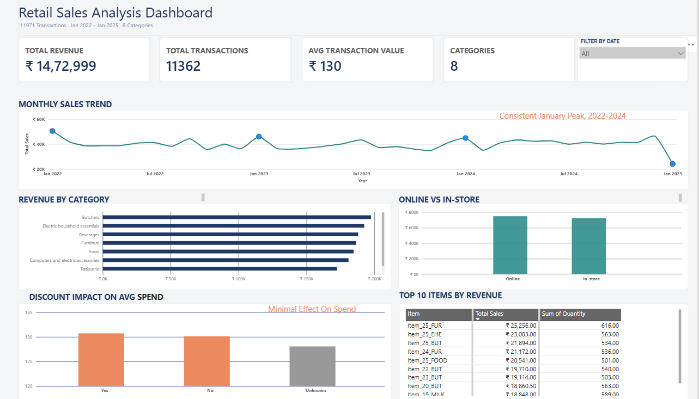

# Retail-Sales-Analysis
# Retail Sales Data Cleaning & Analysis

An end-to-end data analysis project on a real retail transactions dataset — from raw, messy data to business insights.

## Objective

To take a real-world, imperfect dataset and turn it into useful business insights — the same workflow used in an actual data analyst role. This project focuses on making sound data cleaning decisions, not just running formulas on ready-made data.

## Dataset

- Source: [Kaggle — Retail Store Sales: Dirty for Data Cleaning](https://www.kaggle.com/datasets/ahmedmohamed2003/retail-store-sales-dirty-for-data-cleaning)
- 12,575 transaction records
- 8 product categories (Patisserie, Milk Products, Butchers, Beverages, Food, Furniture, Electric Household Essentials, Computers & Electric Accessories)
- Missing values across 5 columns

## Tools Used

- **Power Query (Excel)** — data cleaning
- **MySQL** — data analysis using SQL
- **Power BI** — dashboard and visualization

## Data Cleaning

The raw dataset had missing values in `Item`, `Price Per Unit`, `Quantity`, `Total Spent`, and `Discount Applied` (33% missing).

| Issue | Decision | Reasoning |
|---|---|---|
| Missing Price Per Unit only (609 rows) | Recalculated as `Total Spent ÷ Quantity` | Value was mathematically recoverable, no need to lose the row |
| Missing both Quantity & Total Spent (604 rows) | Dropped | No reliable way to reconstruct the true value |
| Missing Discount Applied (33% of rows) | Labeled as "Unknown" | Assuming "No discount" would have been a guess, not a fact |
| Missing Item name (609 rows) | Labeled as "Unknown Item" | Rest of the row (price, quantity, category) was still valid and usable |

Final cleaned dataset: **11,971 rows, zero missing values.**

## SQL Analysis

Queries covered:
- Revenue by category
- Online vs in-store performance
- Payment method breakdown
- Top-selling items overall (by total revenue)
- Monthly sales trend
- Discount impact on average transaction value

See [`queries.sql`](./queries.sql) for the full set of queries.

## Key Insights

- **Seasonal pattern:** Sales consistently peak every January, across all 3 full years in the data (2022–2024).
- **Discount impact:** Average transaction value was nearly identical regardless of discount status (₹130.49 vs ₹129.95 vs ₹128.51) — discounting had minimal effect on how much customers spent.
- **Balanced categories:** Revenue was fairly evenly spread across all 8 categories (no single category dominated).
- **Channel split:** Online (₹791,401) and in-store (₹760,670) sales were close, with online slightly ahead.

## Dashboard

Includes KPI cards, a monthly sales trend line, category and location breakdowns, a discount impact comparison, and a top 10 items table.

## What I Learned

Real data is never clean. The most important part of this project wasn't writing SQL queries — it was deciding, column by column, whether to recover, drop, or clearly label missing data instead of guessing. That decision-making process is what I'd bring into a real analyst role.
